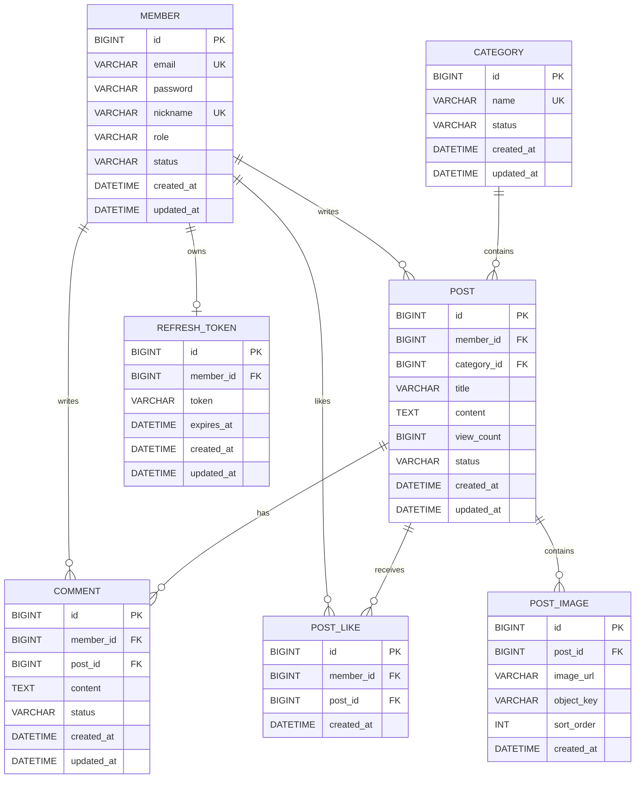

# 게시판 프로젝트 ERD



# 테이블별 설계

## MEMBER

| 컬럼         | 타입           | 제약조건               | 설명                           |
| ---------- | ------------ | ------------------ | ---------------------------- |
| id         | BIGINT       | PK, AUTO_INCREMENT | 회원 식별자                       |
| email      | VARCHAR(255) | NOT NULL, UNIQUE   | 로그인 이메일                      |
| password   | VARCHAR(255) | NOT NULL           | 암호화된 비밀번호                    |
| nickname   | VARCHAR(50)  | NOT NULL, UNIQUE   | 사용자 닉네임                      |
| role       | VARCHAR(20)  | NOT NULL           | USER, ADMIN                  |
| status     | VARCHAR(20)  | NOT NULL           | ACTIVE, SUSPENDED, WITHDRAWN |
| created_at | DATETIME(6)  | NOT NULL           | 생성 시각                        |
| updated_at | DATETIME(6)  | NOT NULL           | 수정 시각                        |

## CATEGORY

| 컬럼         | 타입          | 제약조건               | 설명               |
| ---------- | ----------- | ------------------ | ---------------- |
| id         | BIGINT      | PK, AUTO_INCREMENT | 카테고리 식별자         |
| name       | VARCHAR(50) | NOT NULL, UNIQUE   | 카테고리 이름          |
| status     | VARCHAR(20) | NOT NULL           | ACTIVE, INACTIVE |
| created_at | DATETIME(6) | NOT NULL           | 생성 시각            |
| updated_at | DATETIME(6) | NOT NULL           | 수정 시각            |

## POST

| 컬럼          | 타입           | 제약조건                | 설명                 |
| ----------- | ------------ | ------------------- | ------------------ |
| id          | BIGINT       | PK, AUTO_INCREMENT  | 게시글 식별자            |
| member_id   | BIGINT       | NOT NULL, FK        | 작성자                |
| category_id | BIGINT       | NOT NULL, FK        | 카테고리               |
| title       | VARCHAR(100) | NOT NULL            | 제목                 |
| content     | TEXT         | NOT NULL            | 본문                 |
| view_count  | BIGINT       | NOT NULL, DEFAULT 0 | 조회 수               |
| status      | VARCHAR(20)  | NOT NULL            | PUBLISHED, DELETED |
| created_at  | DATETIME(6)  | NOT NULL            | 작성 시각              |
| updated_at  | DATETIME(6)  | NOT NULL            | 수정 시각              |

## COMMENT

| 컬럼         | 타입          | 제약조건               | 설명                 |
| ---------- | ----------- | ------------------ | ------------------ |
| id         | BIGINT      | PK, AUTO_INCREMENT | 댓글 식별자             |
| member_id  | BIGINT      | NOT NULL, FK       | 댓글 작성자             |
| post_id    | BIGINT      | NOT NULL, FK       | 게시글                |
| content    | TEXT        | NOT NULL           | 댓글 내용              |
| status     | VARCHAR(20) | NOT NULL           | PUBLISHED, DELETED |
| created_at | DATETIME(6) | NOT NULL           | 작성 시각              |
| updated_at | DATETIME(6) | NOT NULL           | 수정 시각              |

## POST_LIKE

| 컬럼         | 타입          | 제약조건               | 설명      |
| ---------- | ----------- | ------------------ | ------- |
| id         | BIGINT      | PK, AUTO_INCREMENT | 좋아요 식별자 |
| member_id  | BIGINT      | NOT NULL, FK       | 좋아요 사용자 |
| post_id    | BIGINT      | NOT NULL, FK       | 좋아요 게시글 |
| created_at | DATETIME(6) | NOT NULL           | 등록 시각   |

다음 복합 유니크 제약조건을 설정한다.

```sql
ALTER TABLE post_like
ADD CONSTRAINT uk_post_like_member_post
UNIQUE (member_id, post_id);
```

## POST_IMAGE

| 컬럼         | 타입            | 제약조건               | 설명         |
| ---------- | ------------- | ------------------ | ---------- |
| id         | BIGINT        | PK, AUTO_INCREMENT | 이미지 식별자    |
| post_id    | BIGINT        | NOT NULL, FK       | 게시글        |
| image_url  | VARCHAR(1000) | NOT NULL           | 이미지 접근 URL |
| object_key | VARCHAR(500)  | NOT NULL, UNIQUE   | S3 객체 키    |
| sort_order | INT           | NOT NULL           | 이미지 표시 순서  |
| created_at | DATETIME(6)   | NOT NULL           | 생성 시각      |

## REFRESH_TOKEN

| 컬럼         | 타입            | 제약조건                 | 설명            |
| ---------- | ------------- | -------------------- | ------------- |
| id         | BIGINT        | PK, AUTO_INCREMENT   | 토큰 식별자        |
| member_id  | BIGINT        | NOT NULL, UNIQUE, FK | 토큰 소유자        |
| token      | VARCHAR(1000) | NOT NULL             | Refresh Token |
| expires_at | DATETIME(6)   | NOT NULL             | 만료 시각         |
| created_at | DATETIME(6)   | NOT NULL             | 생성 시각         |
| updated_at | DATETIME(6)   | NOT NULL             | 수정 시각         |

# 외래키 정책

초기 구현에서는 JPA와 서비스 계층에서 데이터 삭제 순서를 관리하고, 외래키에 `ON DELETE CASCADE`를 남용하지 않는다.

* 회원 탈퇴: 회원 상태만 변경한다.
* 게시글 삭제: 게시글 상태만 변경한다.
* 댓글 삭제: 댓글 상태만 변경한다.
* 좋아요 취소: `POST_LIKE` 행을 물리 삭제한다.
* 로그아웃: `REFRESH_TOKEN` 행을 물리 삭제한다.
* 이미지 삭제: S3 객체와 `POST_IMAGE` 행을 함께 삭제한다.

# 인덱스 후보

```sql
CREATE INDEX idx_post_status_created_at
ON post (status, created_at DESC);

CREATE INDEX idx_post_category_status_created_at
ON post (category_id, status, created_at DESC);

CREATE INDEX idx_comment_post_status_created_at
ON comment (post_id, status, created_at ASC);

CREATE INDEX idx_post_like_post_id
ON post_like (post_id);
```

검색 기능에 `%keyword%` 형태의 `LIKE` 검색을 사용하면 일반 B-Tree 인덱스를 효과적으로 활용하기 어렵다. MVP에서는 단순 검색을 구현하고, 추후 MySQL Full-Text Index나 Elasticsearch 적용을 확장 과제로 검토한다.
